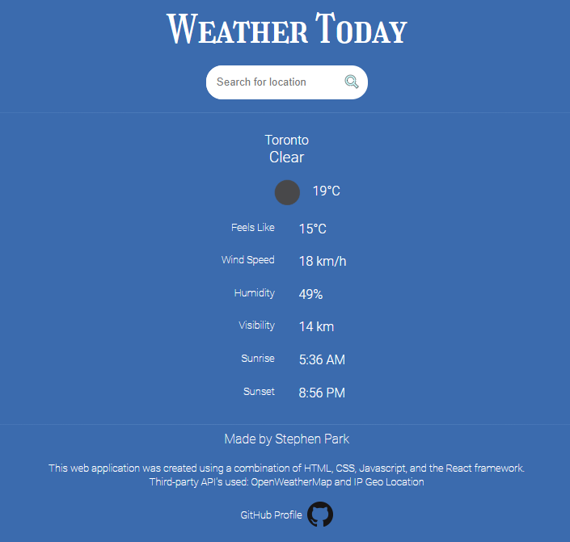

# Weather Today

## Description
A full-stack web application made with the React framework as front-end and NodeJS/Express as back-end. It fetches geolocation data and weather data from third-party APIs.

## Demo Link:
https://weather-today-react.herokuapp.com/

## Screenshot

## Third-party APIs used:
<ul>
    <li>OpenWeatherMap API: https://openweathermap.org/api</li>
    <li>LocationIQ API: https://locationiq.com/</li>
    <li>IP Stack API: https://ipstack.com/</li>
</ul>
